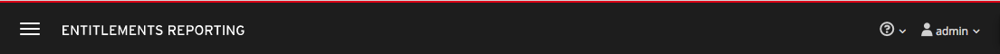

# Masthead

  

The PatternFly [Masthead](http://www.patternfly.org/pattern-library/application-framework/masthead/#/design) design should be followed for the and in this case the masthead should include the following from left to right:
1. **Name and Branding** Entitlements
1. **Help:** This menu should include about.
1. **User:** The username should be listed to the right of the icon. The "Log Out" option should be available in this dropdown menu.
